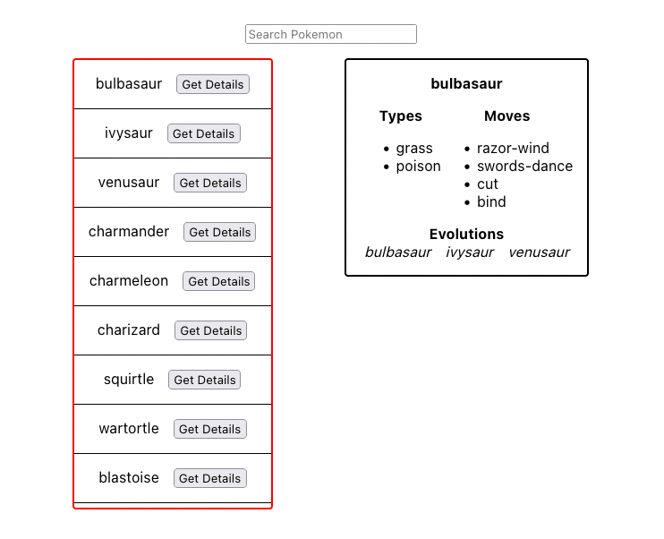

# Givebutter Frontend Take-home

## Overview

Our goal is to fix and enhance a Pokedex application. If you are unfamiliar with the world of Pokemon, here is a brief explanation:

> The Pokedex is an electronic device created and designed to catalog and provide information regarding the various species of Pokemon featured in the Pokemon video game, anime and manga series.
 
[Source](https://pokemon.fandom.com/wiki/Pokedex)
 
Our version of the Pokedex is able to list and search through Pokemon. However, our search is a bit buggy. Additionally, we want to add a feature that shows a selected Pokemon's details like its **type**, **moves**, and **evolution chain**.

Your time is valuable, and we are extremely appreciative of you participating in this assessment. We're looking to gauge your ability to read and edit code, understand instructions, and deliver features, just as you would during your typical day-to-day work. We expect this test to take no more than one to two hours and ask to complete this work within the next two days. Upon submit, we will review and provide feedback to you regardless of our decision to continue the process.

Please update and add code in `App.js` and `index.css` based on the requirements found below. Additionally, we ask you to edit the `readme.md` with answers to a few questions found in the `Follow-up Questions` section also found below.

When you are finished, please upload your completed work to your Github and invite `@gperl27` to view it. **Do not open a PR please.**

## Setup

- This repo was scaffolded using `create-react-app`. As such, this app requires a stable version of `node` to get up and running.
- Clone this repo and run `npm install`.
- To run the app, run `npm start`.
- Please reach out to the Givebutter team if you have any issues with the initial setup or have any problems when running the initial app.

## Requirements

### Search
- Typing in the search input should filter the existing Pokemon list and render only matches found
- Fix any bugs that prevent the search functionality from working correctly
- If there are no results from search, render "No Results Found"
- The search results container should be scrollable
- The UI should match the below mockup

### Details Card
     
- Clicking "Get Details" for any given Pokemon should render a card that has the Pokemon's `name`, `types`, `moves`, and `evolution chain`
- Use the api functions defined in `api.js` to retrieve this data. Adding new endpoints or editing existing ones are out of scope
- The details card should match the below mockup

## Follow-up Questions

Please take some time to answer the following questions. Your answers should go directly in this `readme`.

- Given more time, what would you suggest for improving the performance of this app?
    - Answer: 
        - I'd like to spend more time refactoring the App.js file into separate componets, to `<PokemonList />`, `<SearchBar />`, `<Pokemon />`, `<Button />`, `<Input />`, for example. Then apply lazy loading where applicable. 
        - Create an `Atomic design pattern` structure for the components
        - I'd also like to include `Typescript` into the components add `types` and `unions` to hooks and create a `types.ts` file to hold all of the type declarations.
        - I'd also included `Memorization`, and utilize the `useMemo` and `useCallback` hooks.
        - `Infinite scrolling` to the search results list
        - Add some simple transitions and animations between for when the details card of a pokemon appears and the information in the card changes. Would also add some fun stacking animation in the pokemon list section

- Is there anything you would consider doing if we were to go live with this app?
    - Answer:
        - I'd consider syncing with a designer to work on a higher fidelity version of this mockup. Maybe we use a Pokedex frame and include pokemon images to the mockup. So when a user clicks on the get details button the image of the pokemon appears. 
        - I'd also consider utilizing `Amplify` or `Supabase` to give us an out of the box 2FA flow.
        - Give the user the ablility to favorite their pokemon and maybe even compare two pokemon at the same time.
        - Create a simple fun landing page a user can visit, where they'll be information about the available pokemon in the current pokedex.

- What was the most challenging aspect of this work for you (if at all)?
    - Answer:
        - I thought the trickiest aspect of this work was getting the evolution data and different evolutions to appear.